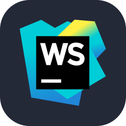

<h2> Hey! I'm JayHrn.</h2>

Hello, I am a programmer + student born in 2002:

- 🌱 I’m currently learning **kubernetes、docker**

- 👨‍💻 All of my projects are available at [GitHub](https://github.com/JayHrn)

- 📝 I regularly write articles on my [Blog](https://blog.jayhrn.cn)

- 💬 You can communicate with me about **Java、Vue、Python...**

- 📫 How to reach me **jayhrn9@gmail.com**

- 📄 Know about my experiences [About Me](https://blog.jayhrn.cn/about/)

- ⚡ Fun fact **I think active**

## Languages and Tools 🎯

I am working hard to learn relevant knowledge

  <!-- 编程语言类 -->
  
  
  
  
  

  <!-- 前端技术栈 -->
  
  
  
  
  

  <!-- 运维与云原生 -->
  
  
  

  <!-- 数据库与中间件 -->
  
  

  <!-- 版本控制与协作 -->
  
  

  <!-- 文档与工具 -->
  
  
  
  

  <!-- 框架与包管理 -->
  
  
  
  

  <!-- 开发工具类 -->
  
  
  
  
  
  
  

## This year's summary ✨

## Achievement 🎉

 

Developed with ❤️ forever  

